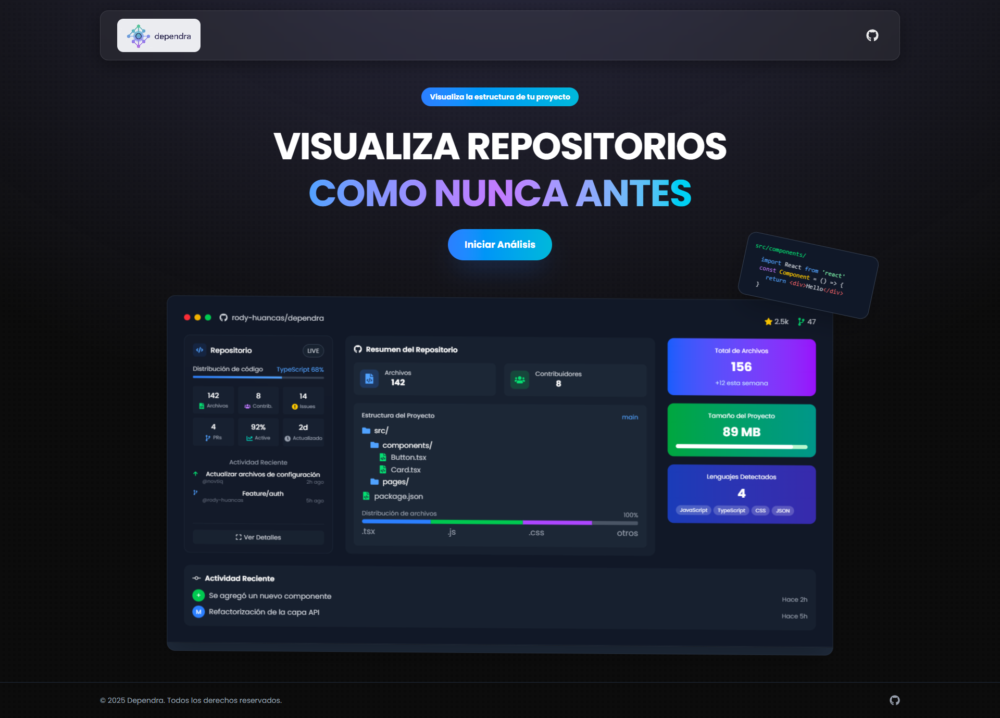

# Dependra - Visualizador de Repositorios

Dependra es una aplicación web moderna que te permite visualizar y analizar la estructura de repositorios de GitHub de manera interactiva. Con una interfaz intuitiva y características avanzadas, podrás explorar la arquitectura de tu código de forma visual.



## 🌟 Características

- 🔍 Visualización interactiva de la estructura de repositorios
- 📊 Análisis de dependencias y relaciones entre archivos
- 🎨 Interfaz moderna y minimalista
- 🌓 Modo claro y oscuro
- ⚡ Rendimiento optimizado
- 📱 Diseño responsive

## 🚀 Tecnologías

- **Frontend:**
  - Next.js 15
  - React
  - TypeScript
  - Tailwind CSS
  - Monaco Editor
  - React Icons
  - Zustand (Gestión de estado)

- **APIs:**
  - GitHub API
  - Octokit

## 📋 Prerrequisitos

- Node.js 18.0 o superior
- npm, yarn, pnpm o bun
- Cuenta de GitHub (para acceder a la API)

## 🔧 Instalación

1. Clona el repositorio:
```bash
git clone https://github.com/rody-huancas/dependra
cd dependra
```

2. Instala las dependencias:
```bash
# Usando npm
npm install

# Usando yarn
yarn install

# Usando pnpm
pnpm install

# Usando bun
bun install
```

3. Renombra el ```.env.example``` por ```.env.local```, y coloca tus credenciales

4. Inicia el servidor de desarrollo:
```bash
# Usando npm
npm run dev

# Usando yarn
yarn dev

# Usando pnpm
pnpm dev

# Usando bun
bun dev
```

5. Abre [http://localhost:3000](http://localhost:3000) en tu navegador.

## 🛠️ Uso

1. Ingresa la URL de un repositorio de GitHub en el campo de búsqueda
2. Haz clic en "Analizar" para visualizar la estructura
3. Explora los archivos y carpetas de manera interactiva
4. Utiliza los controles para ajustar la visualización

## 📦 Estructura del Proyecto

```
dependra/
├── src/
│   ├── app/           # Rutas y páginas (Next.js App Router)
│   ├── components/    # Componentes React
│   ├── services/      # Servicios y APIs
│   ├── store/         # Estado global (Zustand)
│   ├── styles/        # Estilos globales y configuraciones
│   ├── types/         # Definiciones de tipos TypeScript
│   ├── utils/         # Utilidades y helpers
│   └── config/        # Configuraciones
├── public/            # Archivos estáticos
└── ...
```

## 🤝 Contribuir

Las contribuciones son bienvenidas. Para contribuir:

1. Haz fork del proyecto
2. Crea una rama para tu feature (`git checkout -b feature/AmazingFeature`)
3. Commit tus cambios (`git commit -m 'Add some AmazingFeature'`)
4. Push a la rama (`git push origin feature/AmazingFeature`)
5. Abre un Pull Request

## 📝 Licencia

Este proyecto está bajo la Licencia MIT - ver el archivo [LICENSE](LICENSE) para más detalles.

## 👥 Autores

- Rody Huancas - [@rody-huancas](https://github.com/rody-huancas)

## 🙏 Agradecimientos

- [Next.js](https://nextjs.org/)
- [Tailwind CSS](https://tailwindcss.com/)
- [GitHub API](https://docs.github.com/en/rest)
- [Octokit](https://octokit.github.io/)
- [Monaco Editor](https://microsoft.github.io/monaco-editor/)
